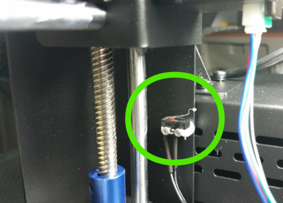

*************************
Build Plate Modifications
*************************

Adding a glass build plate
==========================

Source: http://wanhaousa.com/pages/adding-a-glass-build-plate

The Duplicator i3 does not come with a removal build plate. Instead, the printer has a fixed aluminum build platform which is attached via the bed leveling screws. However, we wanted to be able to remove the build plate at the end of prints in order to facilitate back-to-back printing. With the stock aluminum platform this would be impossible due to the lengthy removal process of the platform. The easy solution is to use a glass build plate attached by binder clips...it's easy, it's inexpensive, and it works. The glass build plate simply clips onto the aluminum platform and is easily removal via the binder clips.

Sourcing a glass sheet: You can usually find a local hardware store that will cut glass for you on the spot. This would be your most convenient and least expensive option as glass usually runs between $3-$10 per sheet with custom cutting. If you do not have a local outlet to purchase a glass build plate you can find glass sheeting online by going to McMaster-Carr (http://www.mcmaster.com/) if you are in the USA and searching for Heat-Resistant Borosilicate Glass. 

Size: We recommend a sheet/plate of glass measuring 8in (L) x 8.5in(W) x 1.8in(Th.).

Ordering Online: If you are ordering from McMaster-Carr you will notice that they only list glass sheeting in whole inch selections. For Example: They list 8in. x 8in. sheets but not 8in. x 8.5in. sheets. You will need to click on the link within the product description paragraph currently labeled 8476K81 and it will open up a menu on the left side of your browser window:

In that new left-side menu there will be a section labeled Specifications where you can enter the dimensions listed above:

Installation: You will need to account for the added thickness to your entire printing platform due to adding of your new glass build plate.  This means that you will need to tighten the 4 wingnuts on the bottom of your printing platform in order to lower the platform and compensate for the added thickness. You will notice that when you tighten your 4 wingnuts that your platform springs contract...this creates more compression between the platform and the aluminum build plate. Too much or too little compression is not good. You want to have a good amount of springiness but not so little that the springs are loose. 

What if you tightened the wingnuts and you still cannot level your bed properly? You may need to raise the Z-Axis endstop switch so that it is triggered at a higher point along the X-Axis' decent during homing. This would allow you to calibrate your bed properly and it would also put less tension on your platform springs.

 

Raising your Z-Axis Endstop: If you are facing the printer the Z-Axis endstop switch will be behind the printer column on the left side:

There is no way to raise this endstop without modification as it is in a fixed position. The solution is to print out a riser that will allow you to move the endstop up and/or down to the target position. We have designed a simple riser which can be secured in between the endstop and the printer frame which will allow this up/down movement. You should source two additional screws to help secure the new riser but this is not entirely necessary. Although not optimal, you can use the same 2 screws that secured the original endstop to attach both the new riser and the endstop by using only one screw for each. 

*Below you can find the STL for the riser. We suggest printing the model with a solid infill.

	Inside Printer View

.. figure:: OutsideView.png

	Outside Printer View

	Riser with Endstop Switch Attached

   `Z-Axis Enstop Riser STL V3`_ 
   

.. _Z-Axis Enstop Riser STL V3: Z-Axis_Endstop_Riser_V3.stl

