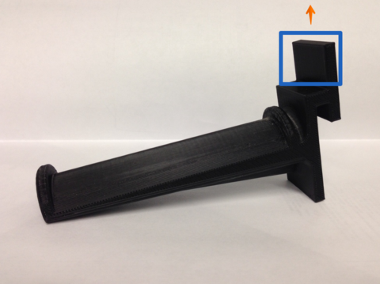

****************************
Filament Stand Modifications
****************************

Narrow Spool Holder
===================

Source: http://wanhaousa.com/pages/using-filament-spools-with-a-narrow-center-hole

Using Filament Spools With A Narrow Center Hole

The spool holder that comes with your Duplicator i3 is a standard diameter which will fit most filament reels. However, there are many different sized spools and we want you to be able to use all of them with your Duplicator i3. Below is the STL for a filament spool holder that will fit in Taulman-sized filament spools. In addition to the STL listed below you can also customize your own spool holder by going HERE. 

.. figure:: narrow_spool_holder.png

   `Narrower Spool Holder (Taulman-Sized) STL`_ 
   

**Be aware that if you are customizing your own spool holder in the above linked customizer that you will also need to add length to the portion of the spool holder highlighted below in blue. Editing just this portion is not customizable by itself in the link above so you need to use CAD program to get it done (takes 5 minutes in `Sketchup`_). You will need to extend the highlighted portion by about 15mm to fit the slot on the Duplicator i3:**

.. _Narrower Spool Holder (Taulman-Sized) STL: SMALL_Spool_Holder_Adapter.stl

.. _Sketchup: http://www.sketchup.com/