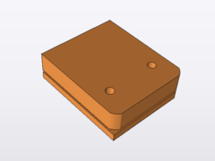

****************************
Filament Stand Modifications
****************************

Top Mount the Filament Stand
============================

Source: http://wanhaousa.com/pages/attaching-the-filament-stand-to-the-top-of-the-printer

Attaching the filament stand to the top of the printer
------------------------------------------------------

The Duplicator i3 comes with a metal filament spool holder stand that attaches to the top of the control box. Using the stock setup the filament feeds from the side of the printer creating a "rainbow" feed route/path to the extruder. However, being long-time Prusa printer users we know that there is a fundamental benefit to allowing filament to feed from directly above the extruder. This improvement allows less wear on the plastic drive block and lets your drive gear get a better grip on your filament. Because of this, we have designed an adapter for the filament spool holder stand to attach to the top of the printer frame.

This adapter allows you to feed filament from directly above the extruder without having to drill any new attachment slots. Simply print out the STL file below and slide the adapter over the top of the printer frame with the two slots facing up. The adapter should fit snugly and line up perfectly with your printer frame. Next, find your filament spool holder stand and place it directly above the adapter so that the slots line up. Attach the stand to the adapter with the two screws included with your stand. 

*Below we have also included an adapter for wide/tall diameter spools. We suggest printing the below adapters with a medium amount of infill.

	`Di3 Filament Stand Adapter STL`_ 

	`Di3 Filament Stand Adapter STL`_

.. _Di3 Filament Stand Adapter STL: Di3_Filament_Stand_Adapter.stl
.. _Big Di3 Filament Stand Adapter STL: BIG_Di3_Filament_Stand_Adapter.stl